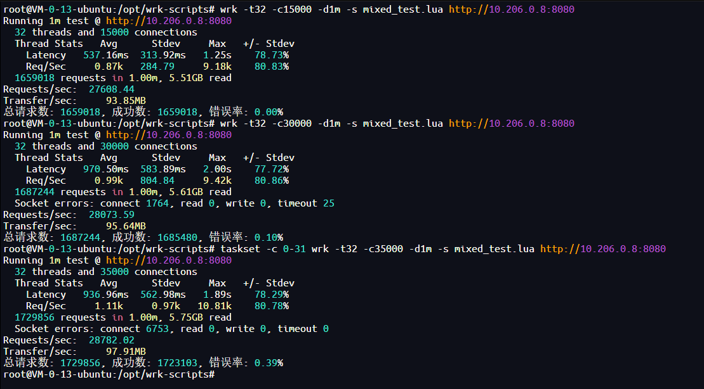
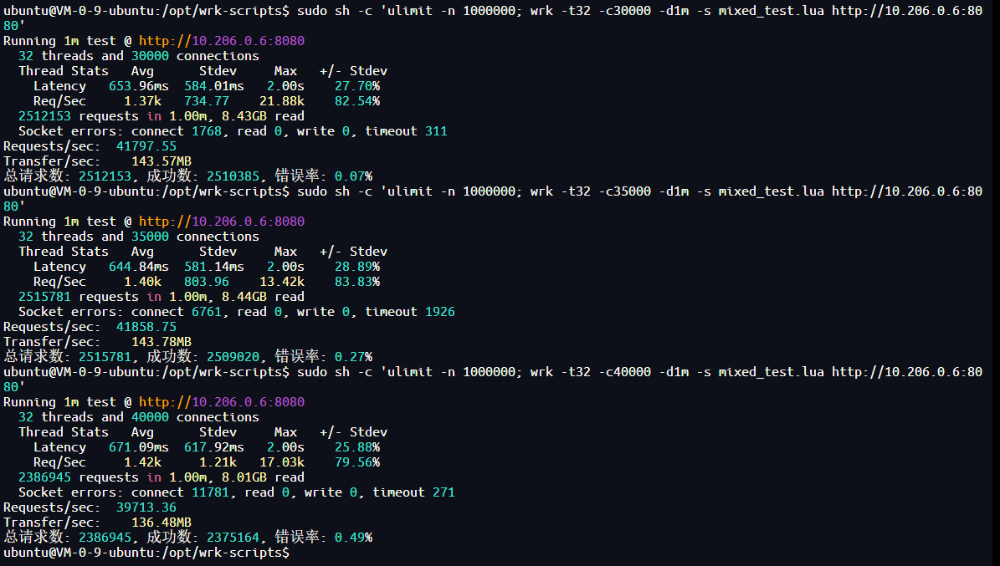

# YoOSF API

## 项目简介

YoOSF API 是一个基于 Go 语言开发的对象存储服务 API，旨在通过对接 S3 存储服务，提供文件的管理、搜索、预签名下载 URL 生成等功能。该服务使用高性能的 Fiber 框架构建 RESTful API，适用于文件管理及分发场景。

---

## 功能概览

以下是系统提供的主要功能：

1. **文件管理**
   - 获取 S3 存储桶中的文件列表（支持过滤与分页）。
   - 为指定文件生成预签名的 URL，支持自定义有效时间。
   - 刷新文件列表缓存。
2. **文件搜索**
   - 支持通过关键字搜索文件名。
   - 返回命中文件的完整路径、元信息及其统计信息。
3. **健康检查**
   - 检查服务运行状态。
4. **缓存**
   - 使用 Redis 提供分布式缓存，加速文件列表访问。
   - 支持本地热点缓存机制，提升高频访问性能。
5. **日志监控**
   - 基于 Zap 实现高效日志记录。
   - 提供错误统计和服务性能监控。

---

## 性能优化

### 缓存架构演进

本项目采用多级缓存架构以提升系统性能，以下是两种主要缓存策略的性能对比：

#### 1. 仅 Redis 分布式缓存

在初始版本中，系统仅使用 Redis 作为分布式缓存层：

- **架构特点**：
    - 所有缓存数据存储在 Redis 中
    - 支持分布式部署和数据一致性
    - 通过网络访问，存在一定延迟

- **性能表现**：
    - 在 32核64G 云服务器压测环境下
    - 最高 QPS：约 28.0k
    - 平均延迟：537-970ms



*仅 Redis 缓存下的性能测试结果 - 28.0k QPS*

#### 2. 启用 LRU 热点缓存算法

为提升高频访问数据的性能，系统引入了本地 LRU 热点缓存：

- **架构特点**：
    - 本地内存缓存 + Redis 分布式缓存
    - LRU（最近最少使用）淘汰算法
    - 自动识别和缓存热点数据
    - 微秒级本地访问延迟

- **性能表现**：
    - 相同硬件环境下性能显著提升
    - 最高 QPS：约 41.7k（提升 49%）
    - 平均延迟：644-671ms（降低约 30%）



*启用 LRU 热点缓存后的性能测试结果 - 41.7k QPS*

### 性能测试数据对比

| 缓存策略 | 并发连接数 | 总请求数 | QPS | 平均延迟 | 错误率 |
|---------|------------|----------|-----|----------|--------|
| 仅 Redis | 15,000 | 1,659,018 | 27,608 | 537ms | 0.00% |
| 仅 Redis | 30,000 | 1,687,244 | 28,073 | 970ms | 0.10% |
| 仅 Redis | 35,000 | 1,729,856 | 28,782 | 937ms | 0.39% |
| LRU+Redis | 30,000 | 2,512,153 | 41,797 | 654ms | 0.07% |
| LRU+Redis | 35,000 | 2,515,781 | 41,858 | 645ms | 0.27% |

### 配置建议

根据实际业务场景选择合适的缓存策略：

```yaml
# 高性能场景推荐配置
cache:
  filesListRefreshIntervalSec: 300
  local_cache:
    enabled: true
    size: 1000                    # 根据内存调整
    mode: "lru"                   # 或 "lfu"
    hot_data_refresh_sec: 30      # 热点数据刷新间隔
    hot_data_threshold: 10        # 热点数据访问阈值
```

---

## 启动与运行

### 1. 本地启动

1. 克隆项目到本地：
   ```bash
   git clone https://github.com/WavesMan/YoOSF-API.git
   cd yoosf-api
   ```

2. 初始化配置文件：
   ```bash
   cp configs/config.yaml.example configs/config.yaml
   # 根据需求修改 configs/config.yaml
   ```

3. 启动服务：
   ```bash
   go run cmd/api/main.go
   ```

4. 测试服务：
    - 检查健康状态：
      ```bash
      curl "http://localhost:8080/health"
      ```
    - 查看文件列表：
      ```bash
      curl "http://localhost:8080/api/files"
      ```

### 2. Linux 生产环境部署

1. 构建部署包：
   ```bash
   chmod +x ./release-build.sh
   ./release-build.sh
   ```

2. 上传部署包（如 `linux-release-25.10.15.zip`）至服务器并解压。

3. 编辑配置文件确保配置符合生产环境：
   ```bash
   cp configs/config.yaml.example configs/config.yaml
   vim configs/config.yaml
   ```

4. 配置并启动服务：
   ```bash
   sudo cp systemctl-files/yoosf-api.service /etc/systemd/system/
   sudo systemctl daemon-reload
   sudo systemctl enable yoosf-api
   sudo systemctl start yoosf-api
   ```

5. 查看服务日志：
   ```bash
   journalctl -u yoosf-api.service -f
   ```

---

## RESTful API 接口

查阅 [API 文档](docs/api.md)

---

## 配置说明

配置文件位于 `configs/config.yaml` 中，以下为主要配置项：

### 1. 服务配置
```yaml
server:
  port: 8080
  goroutine_pool_size: 100
  parallel_download_threads: 5
```

### 2. Redis 缓存
```yaml
redis:
  addr: "localhost:6379"
  password: ""
  db: 0
cache:
  filesListRefreshIntervalSec: 300
  local_cache:
    enabled: true
    size: 1000
    mode: "lru"
    hot_data_refresh_sec: 30
```

### 3. S3 对象存储
```yaml
s3:
  access_key: "your-access-key"
  secret_key: "your-secret-key"
  endpoint: "https://s3.example.com"
  bucket_name: "your-bucket-name"
  listen_dir: "public/"
  cors:
    allowed_origins:
      - "https://example.com"
      - "https://www.example.com"
    allowed_methods:
      - "GET"
      - "POST"
      - "PUT"
      - "DELETE"
```

---


## 文件结构
```plaintext
yoosf-api
├── api               # API 层：路由、控制器及数据模型定义
├── cmd               # 服务启动命令（如 main.go）
├── configs           # 配置文件目录
├── docs              # 项目与 API 文档
├── internal          # 核心逻辑，如服务、工具类等
├── systemctl-files   # Linux 服务文件
├── web               # 前端静态资源（或 Vue 项目）
├── go.mod            # Go 依赖文件
├── release-build.sh  # 构建脚本
```

---

## 技术栈

- **后端语言**: Go 1.24
- **框架**: Fiber
- **存储服务**: S3 兼容对象存储
- **缓存**: Redis
- **任务调度**: Cron
- **日志记录**: Zap

---

## 注意事项

1. **安全性**
    - 生产必须使用 HTTPS。
    - 配置跨域支持，限制来源域名。
2. **性能优化**
    - 合理设置文件缓存刷新间隔与 Redis 并发限制。
3. **Redis 依赖**
    - 服务启动前需确保 Redis 可用，否则可能导致服务启动失败。

---

## 开发与贡献

1. Fork 项目到自己的仓库。
2. 阅读开发者文档 [DeveloperRedme](docs/DeveloperRedme.md)
3. 创建新分支并实现功能或修复 bugs。
4. 提交 PR 并描述变更内容。

---

## License

项目遵循 [GPL-v2](LICENSE)。

